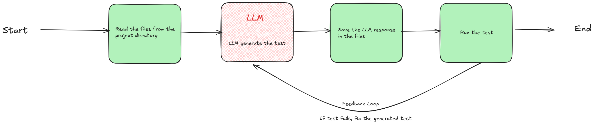

<h1 align="center">Test Generator AI</h1>

<div align="center">

</div>

An AI-powered CLI tool that automatically generates unit tests using a Large Language Model (LLM). The generated tests are run to verify application behavior, and any failures are used as feedback to improve and regenerate the tests.

## 🚀 Features

- **AI-powered unit test generation** using a Large Language Model (LLM) to automatically create tests for Go projects
- **Improved test coverage** by reducing manual test-writing effort while ensuring meaningful validation
- **Automated test execution** to verify application correctness and expected behavior across the entire codebase
- **Feedback-driven regeneration loop** that analyzes compilation errors, test failures, and runtime logs
- **LLM-assisted failure analysis** using GitHub-hosted models to understand errors and apply targeted fixes
- **Faster issue resolution** through iterative test correction until tests compile and pass successfully

## 🏗️ Architecture

The following diagram illustrates the high-level architecture of test-generator-ai.

<p align="center">
  
</p>

## 📖 Prerequisites:
- [Go (version >= 1.23.3)](https://go.dev/) : Programming language
- [Azure OpenAI/ChatGPT 4.1 Mini](https://github.com/marketplace/models/azure-openai/gpt-4-1-mini): Utilized as the LLM backend to generate meaningful and contextual unit test cases for Go project.
- [Go Project (cine-dots)](https://github.com/SaketV8/cine-dots): The Go project under test. The tool integrates with the Go codebase to generate test cases, and run them for validation.

## ⚡ Run on your machine

```bash
git clone https://github.com/SaketV8/test-generator-ai.git
cd test-generator-ai

# install dependencies
go mod download
```

### Setup Env Variable

> [!IMPORTANT]  
> get your own github personal access Token [Here](https://github.com/settings/tokens)

```sh
# rename <.env.example> to <.env>
# and
# set your own github_token

# sample
GITHUB_PAT=YOUR_GITHUB_PERSONAL_ACCESS_TOKEN_GOES_HERE
```

### Start the test-generator-ai

```bash
go build -o test-generator-ai

# starts the test generator
./test-generator-ai

# or

go run main.go
```

## 🖥️ test-generator-ai in Action

<div align="center">
  
</div>

## 🧭 About

This project was created to explore AI-assisted unit test generation for Go projects, with a focus on idiomatic test design, compiler-driven feedback loops, and automated regeneration on failures. It applies Go best practices to improve test reliability, coverage, and overall developer productivity. This is a prototype version that implements test generation using AI (LLMs).
